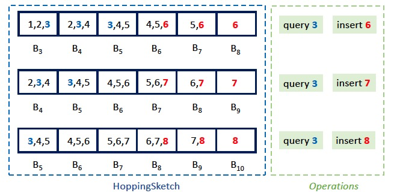
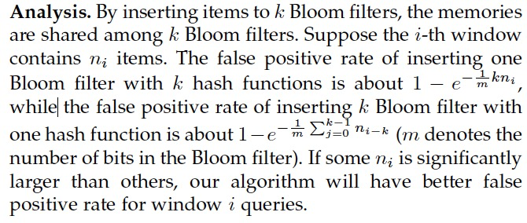
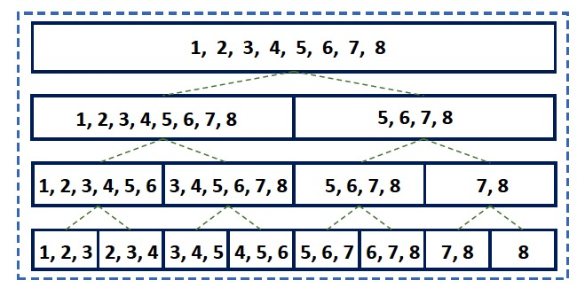

# HoppingSketch: More Accurate Temporal Membership Query and Frequency Query

# 1. 问题

PBF在实现时态成员查询的同时，保持了低误判率和低内存消耗。不幸的是，PBF有两个不足之处。首先，它不支持滑动窗口。第二，它不支持频率查询，即：报告给定项目的出现次数。

## 2. 设计

采用窗口之间共享内存的思想。当窗口大小为3时，查询第三个窗口，需要B3、B4、B5都存在元素。插入第三个窗口，同时插入B3、B4、B5。

隔一个窗口周期删除一个最旧的BF。

理论证明：

将HoppingSketch与PBF结合。简而言之，与原来的PBF-1结构相比，PBF-H的每个节点都保持HoppingSketch，而不是标准的Bloom filter。每层更新的频率也和层的高度有关，例如叶子每个窗口都要更新，上一层就是2个窗口更新一次。因此这个结构和标准的线段树还是有区别的。

