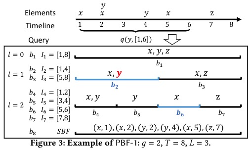
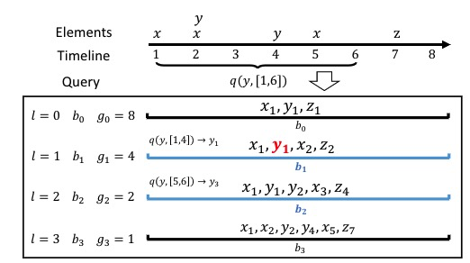

# Persistent Bloom Filter: Membership Testing for the Entire History

# 1.问题

成员资格测试是测试元素是否在一组元素中的问题。精确地执行测试在空间上是昂贵的，需要将所有元素存储在一个集合中。在许多应用中，通常需要使用小空间快速完成近似测试。Bloom过滤器（BF）被设计并在众多应用领域取得了巨大成功。但没有一个紧凑的结构支持时间查询的集合成员资格测试，例如，A是否在上午9:30到9:40之间访问了web服务器？同一个人是否在上午9:45到9:50之间再次访问了网络服务器？使用BF支持这种“临时成员资格测试”是可能的，但我们将证明这是相当昂贵的。为此，本文设计了一种新的用于时间成员关系测试的数据结构，即具有紧凑空间的Persistent Bloom Filter（PBF）。

# 2. 设计

## 2.1 SBF

查询一个区间元素是否出现，有一个简单的做法。元素（x，t）哈希到一个BF中，是插入操作。查询s到t时间段是否出现x，需要查询一系列元素是否存在这个BF中：（x，s）、（x，s+1）、（x，s+2）、、、（x，t），只要有一个元素存在这个BF中，就能说明x出现在这个时间段。

## 2.2 PBF1

单个BF准确的不够，而且查询花费很多时间。因此PBF的作者根据线段树的思想提出了一个持久化的BF。线段树的叶子节点是一个BF，其中保存了每个最小时间间隔的单元出现的元素。叶子节点的父节点是两个叶子节点的合并。具体结构如下：

插入和查询过程和普通的线段树类似。

## 2.3 PBF2

PBF1具有线性数量的BF。BF数量过多不仅会导致空间开销过大，而且会减慢比特分配到不同布隆滤波器的优化过程。还会影响在线情况下的总体精度。 PBF2在每层使用一个BF，但是元素查询和插入时，携带一个编号，即使是一个BF，但是哈希时携带了编号就能把这个BF看作成多个BF。

