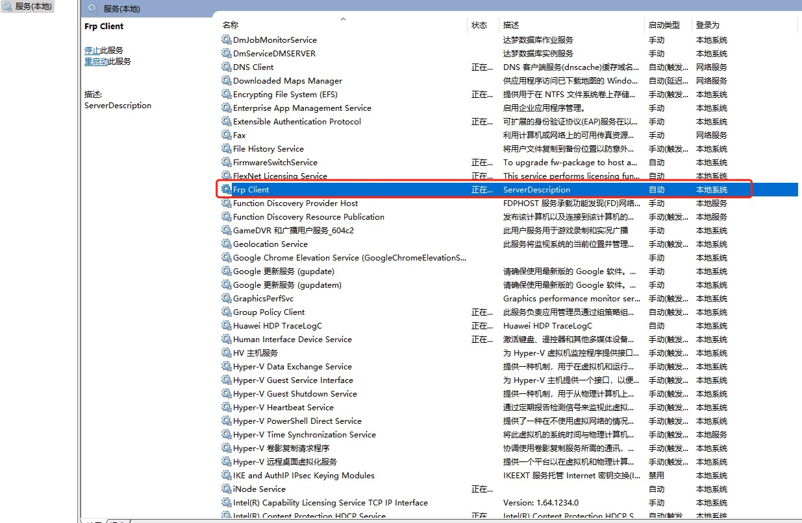
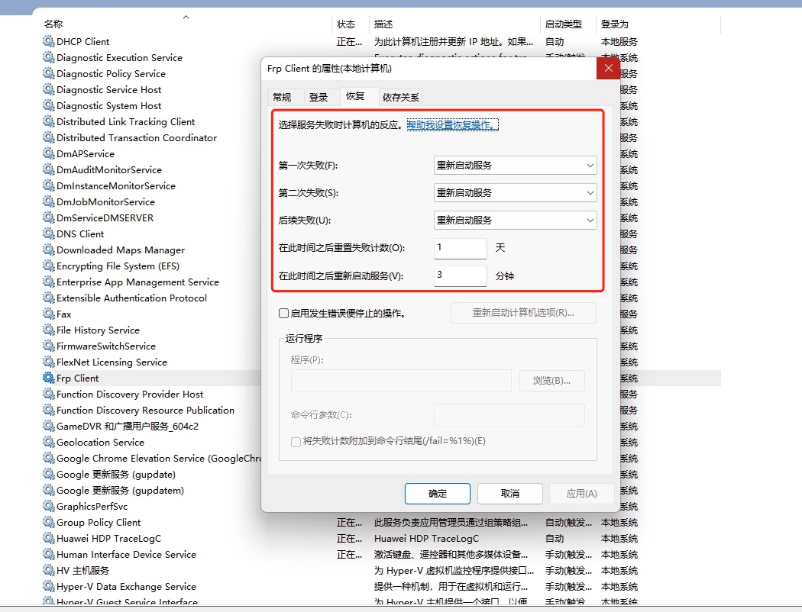

# Windows添加自定义服务

## 前言
有些程序需要开机自启动或重启，将可执行文件添加为服务是一个不错的选择，虽然命令行也能实现这些操作，但是WinSW更加方便。

## 1.下载WinSW
下载链接： https://github.com/winsw/winsw/releases
并修改WinSW.exe 为 serviceName.exe 


## 2. 配置

在WinSW相同目录下新建xml文件 serviceName.xml 并编辑
```xml
<service>
  <!-- ID of the service. It should be unique across the Windows system-->
  <id>3389</id>
  <!-- Display name of the service -->
  <name>Frp Client</name>
  <!-- Service description -->
  <description>ServerDescription</description>
  <!-- Path to the executable, which should be started -->
  <executable>D:\workspace\frp_0.48.0_windows_amd64\frpc.exe </executable>
  <arguments>-c D:\workspace\frp_0.48.0_windows_amd64\frpc.ini</arguments>
</service>

```


## 3.安装

在cmd窗口执行：

```shell
serviceName.exe install
```


安装成功就能在windows服务管理页面管理这个服务：




建议开机自启的服务这样配置，三次失败都改成重启服务：


