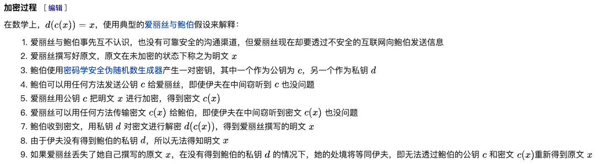

# ssh连接过程


今天我在本机用ssh连接虚拟机，输入ip地址，用户名和密码后，提示需要验证某个指纹，系统提示了下面的信息：

```
The authenticity of host '172.16.30.128 (172.16.30.128)' can't be established.
ED25519 key fingerprint is SHA256:egmND2sQBiCsUj2nw8vGRr+iMYxnDiOzh4E2WFawWgk.
This key is not known by any other names
Are you sure you want to continue connecting (yes/no/[fingerprint])? yes
Warning: Permanently added '172.16.30.128' (ED25519) to the list of known hosts.
```


按理说，ssh知道了ip地址，用户名和密码，应该是有了足够的信息来连接远程主机，不需要指纹信息。在询问了chatgpt之后发现，这是一种防止中间人攻击（Man-in-the-Middle Attack）的措施，以确保连接的安全性和准确性。如果直接通过IP地址和用户名和密码登录远程主机，则存在中间人攻击的风险。攻击者可以劫持通信，让用户误认为他们正在连接到正确的远程主机，但实际上，他们正在连接到一个受攻击的虚假主机，这可能导致数据泄露或其他安全问题。因此需要本机需要验证对方主机是否为自己想连接的主机。

本地主机和远程主机都可以通过远程主机的指纹数据来计算出远程主机的指纹。本地主机的操作人员需要检查计算出来的指纹和远程主机上的指纹是否匹配。如果匹配，这个连接就是正常的。中间人无法伪造指纹数据，因为指纹数据在传输过程中是加密的。

指纹数据的传输过程采用了公开密钥加密算法。

